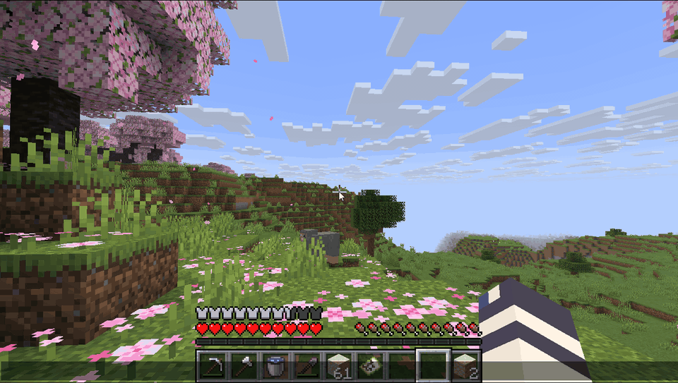
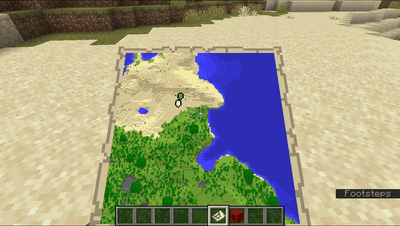
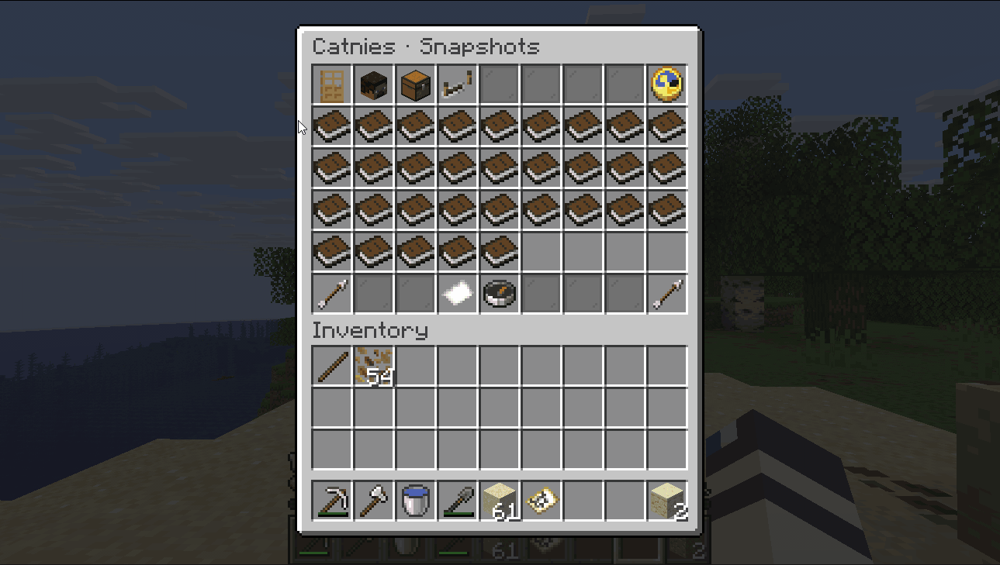
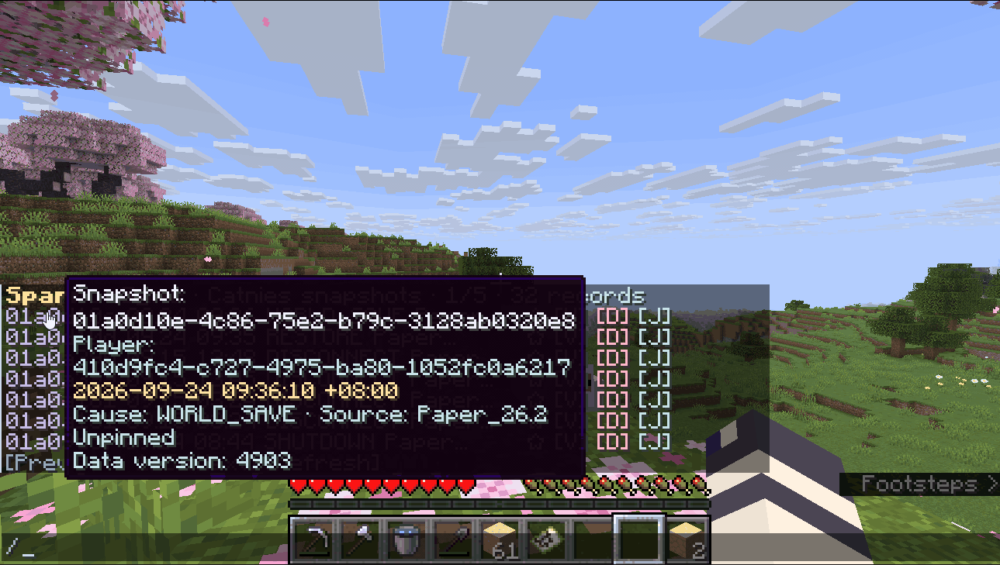
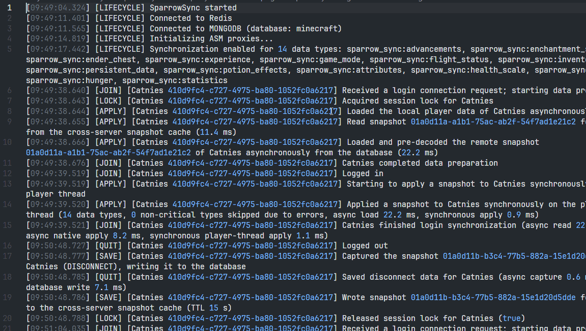

<h1 align="center">
  
  <br>
  Sparrow Sync
</h1>

<p align="center">为 Paper / Folia 服务器提供玩家数据同步与快照管理。</p>

<p align="center">
  <a href="./README.md">English</a> · <strong>简体中文</strong>
</p>

<p align="center">
  <a href="./LICENSE"></a>
  
  <a href="https://nanamoserver.github.io/sparrow-sync-wiki/zh-Hans/"></a>
</p>

## 📌 项目简介

Sparrow Sync 是一款用于**跨服务器同步玩家数据**的 **Paper / Folia 插件**。它通过 Redis 协调玩家会话，并将玩家数据保存为持久化快照，让玩家在不同服务器之间延续游戏进度，也方便管理员恢复历史存档。

## 🔥 核心功能

- **🔄 玩家数据同步**：支持背包、末影箱、经验、生命值、饥饿值、药水效果、进度、统计、属性、位置等数据，可在配置中选择需要同步的数据类型。
- **🚀 低主线程占用**：玩家加入和退出服务器时，几乎所有任务都支持异步执行，主线程耗时可做到与数据量大小无关。实测中，单次加入服务器的主线程耗时几乎均 **≤ 0.2 ms**。
- **✨ 非冻结式同步**：在 `onJoin` 前完成大部分数据同步，无需在玩家进入世界后冻结玩家，提供无缝的进服体验。
- **🗄️ 多种存储后端**：支持使用 **MongoDB**、**MySQL**、**MariaDB** 或 **PostgreSQL** 持久化数据，通过 **Redis** 协调跨服操作。
- **📦 快照压缩**：使用 Sparrow NBT 保存玩家数据，支持 **Zstd**、Deflate 和不压缩三种格式。
- **🖥️ 快照管理菜单**：在游戏内浏览快照、查看内容、恢复历史数据、固定记录和导出快照。
- **🗺️ 地图同步**：在服务器之间共享地图数据，支持配置同步模式和交互限制。
- **🔧 数据恢复工具**：查看本地异常档案，通过快照导入、导出和批量归档命令管理数据。

## 🎬 功能演示

### ✨ 无冻结进服与 🗺️ 跨服地图

<p align="center">
  
  
</p>

### 🖥️ GUI 与文字快照管理

<p align="center">
  
  
</p>

### 🧾 独立完整日志

<p align="center">
  
</p>

## 🔧 构建项目

### 💻 命令行

1. 安装 **JDK 21**。项目的 Gradle 工具链指定使用 **JetBrains** 发行版。
2. 打开终端，进入项目目录。
3. 执行：

   ```sh
   ./gradlew build
   ```

   Windows PowerShell 用户执行：

   ```powershell
   .\gradlew.bat build
   ```

4. 构建完成后，插件位于 **`target/sparrow-sync-<version>.jar`**。

### 🛠️ 使用 IDE

1. 将项目作为 **Gradle 项目**导入 IDE。
2. 配置 Java 21 工具链，执行 **Gradle build** 任务。
3. 在 **`/target`** 目录中找到插件 JAR。

## 🤝 参与贡献

### 🌍 翻译

需要翻译的文本分为两类：玩家可见的消息，以及生成配置文件中的注释。

#### 📄 语言文件

1. 克隆仓库。
2. 参考现有语言文件，在以下目录中添加你的翻译：

   ```text
   common-files/src/main/resources/translations/
   ```

3. 文件名对应语言环境，使用小写的 `language_country` 形式，例如 `zh_CN` 对应 `zh_cn.yml`；没有地区变体时也可以只写语言，例如 `en.yml`。
4. 保留翻译键、参数占位符和 MiniMessage 格式。

#### 📝 配置文件注释

生成的 `config.yml` 和 `server.yml` 中的注释来自 `core/src/main/java/net/momirealms/sparrow/sync/plugin/configuration/` 下配置类上的 `@Comment` 注解。每个配置项都带有一条英文回退注释及其多语言变体：

```java
@Comment("Enables or disables metrics collection via BStats")
@Comment(lang = "zh-CN", value = "是否启用 BStats 统计数据收集")
boolean metrics = true;
```

要翻译它们，按照同样的方式添加带有你自己 `lang` 标签的 `@Comment` 即可：

```java
@Comment(lang = "pt-BR", value = "Ativa ou desativa a coleta de métricas via BStats")
```

- 使用 BCP-47 语言标签，例如 `zh-CN`、`pt-BR`、`en-US`。
- 多行注释使用数组：`value = {"第一行", "第二行"}`。
- 不带 `lang` 的 `@Comment` 是未匹配到语言时使用的回退注释，请保持原样。
- 匹配顺序为完整标签（`zh-CN`）→ 语言加文字体系（`zh-Hans`）→ 纯语言（`zh`）→ 回退注释，因此只写语言的标签（如 `pt`）可以覆盖所有地区变体。
- 实际写入配置文件的变体取决于服务端的默认语言环境，且已生成的配置文件会保留原有注释。

#### 📬 提交

提交 **Pull Request** 供我们审核。欢迎参与贡献！💖

### 💖 Support the Developer
在以下平台购买 SparrowSync 的许可证, 获得官方支持, 维持 SparrowSync 的开发.

- **VoxelShop**: [Soon](https://voxel.shop)
- **BuiltByBit**: [Soon](https://builtbybit.com)
- **NMCrate**: [Soon](https://nmcrate.com)
- **Afdian**: [Support via Afdian](https://afdian.com/@xiaomomi/)

## 📜 许可证

Sparrow Sync 采用 **GNU General Public License v3.0** 许可证。详情请参阅 [LICENSE](LICENSE)。
